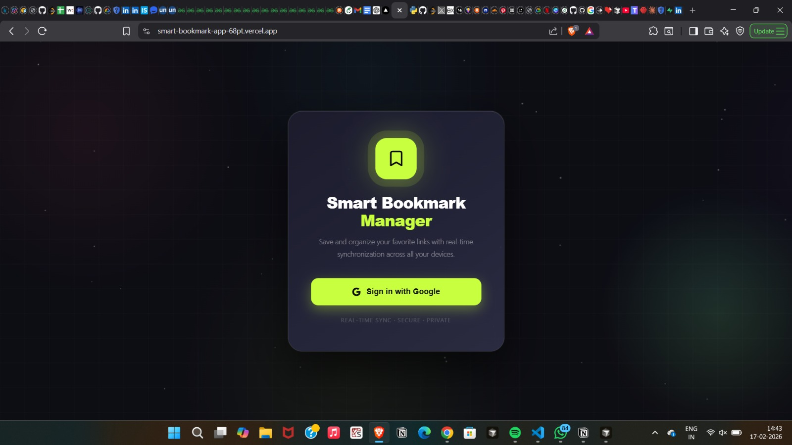
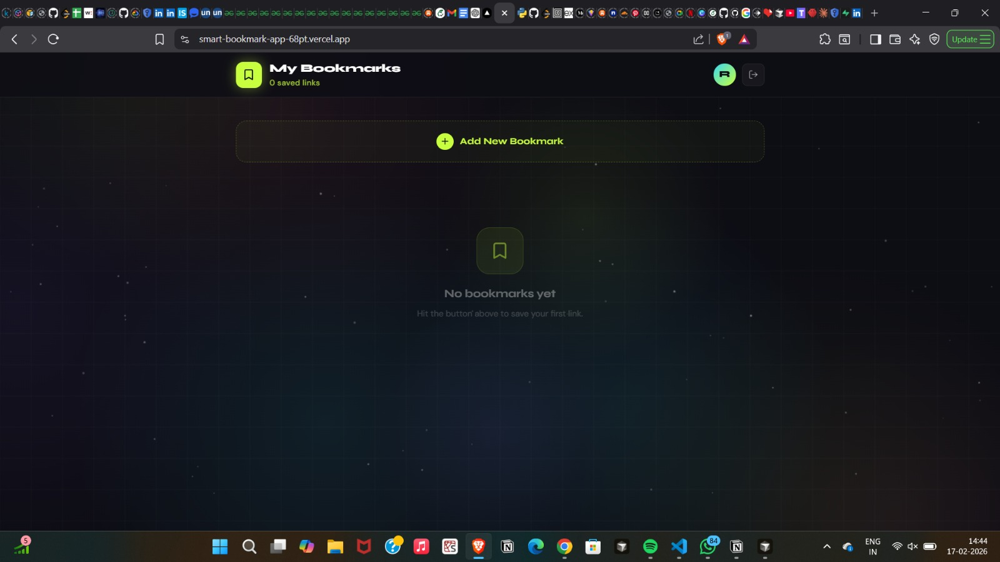
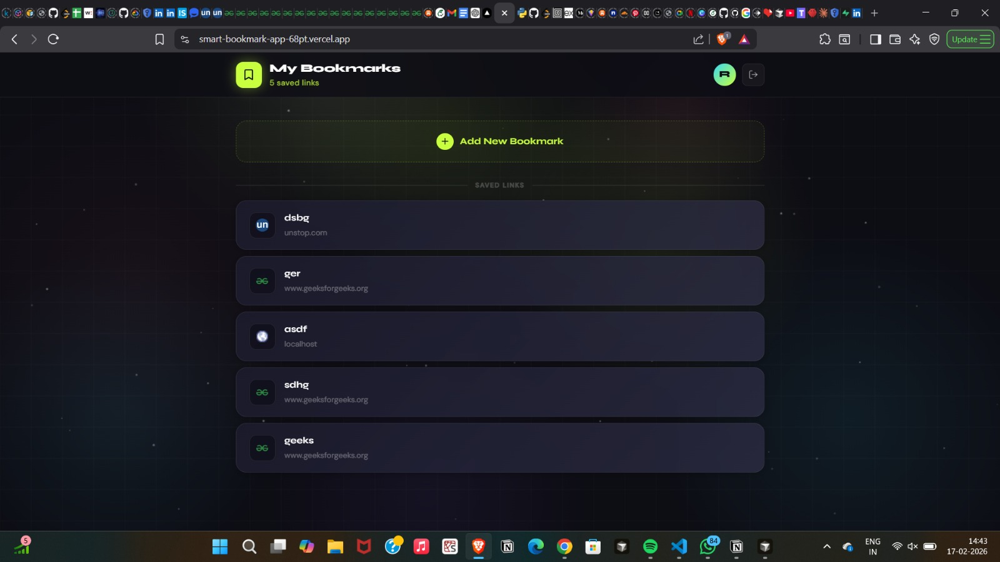

<div align="center">

# 🔖 Smart Bookmark Manager

**A real-time, privacy-first bookmark manager built with Next.js 14, Supabase & Tailwind CSS**


---

> 💡 **Live Demo**: (https://smart-bookmark-app-68pt.vercel.app/)

</div>

---

## ✨ Features

| Feature | Description |
|--------|-------------|
| 🔐 **Google OAuth** | Secure sign-in via Google — no passwords needed |
| 🔒 **Private Bookmarks** | Every user sees only their own data (Row Level Security) |
| ⚡ **Real-time Sync** | Add/delete bookmarks — changes appear instantly across all open tabs |
| 📌 **Add Bookmarks** | Save any URL with a custom title in one click |
| 🗑️ **Delete Bookmarks** | Remove bookmarks with a smooth hover-to-reveal button |
| 📱 **Responsive UI** | Works beautifully on mobile, tablet, and desktop |
| 🚀 **Deployed on Vercel** | Production-ready with a live public URL |

---

## 📸 Screenshots

### 🔑 Login Screen



### 📌 Adding a Bookmark



### 📋 Bookmarks List


---

## 🛠️ Tech Stack

```
Frontend  →  Next.js 14 (App Router) + TypeScript + Tailwind CSS
Backend   →  Supabase (Auth + PostgreSQL + Realtime)
Auth      →  Google OAuth via Supabase Auth
Deploy    →  Vercel
Icons     →  Lucide React
```

---

## 🗂️ Project Structure

```
smart-bookmark-app/
├── app/
│   ├── auth/
│   │   └── callback/
│   │       └── route.ts        # OAuth callback handler
│   ├── globals.css             # Global Tailwind styles
│   ├── layout.tsx              # Root layout
│   └── page.tsx                # Main app (auth + bookmarks UI)
├── lib/
│   ├── supabase/
│   │   ├── client.ts           # Browser Supabase client
│   │   └── server.ts           # Server-side Supabase client
│   └── types.ts                # TypeScript interfaces
├── .env.local                  # Environment variables (not committed)
├── next.config.js
├── tailwind.config.js
└── README.md
```

---

## ⚙️ Setup & Installation

### 1. Clone the Repo

```bash
git clone https://github.com/roshaldsouza/Smart-bookmark-app.git
cd smart-bookmark-app
npm install
```

### 2. Create Supabase Project

1. Go to [supabase.com](https://supabase.com) → New Project
2. Open the **SQL Editor** and run this schema:

```sql
-- Create bookmarks table
CREATE TABLE bookmarks (
  id UUID DEFAULT gen_random_uuid() PRIMARY KEY,
  user_id UUID REFERENCES auth.users(id) ON DELETE CASCADE NOT NULL,
  url TEXT NOT NULL,
  title TEXT NOT NULL,
  created_at TIMESTAMP WITH TIME ZONE DEFAULT timezone('utc'::text, now()) NOT NULL
);

-- Enable Row Level Security
ALTER TABLE bookmarks ENABLE ROW LEVEL SECURITY;

CREATE POLICY "Users can view own bookmarks"
  ON bookmarks FOR SELECT USING (auth.uid() = user_id);

CREATE POLICY "Users can insert own bookmarks"
  ON bookmarks FOR INSERT WITH CHECK (auth.uid() = user_id);

CREATE POLICY "Users can delete own bookmarks"
  ON bookmarks FOR DELETE USING (auth.uid() = user_id);

CREATE INDEX bookmarks_user_id_idx ON bookmarks(user_id);

ALTER PUBLICATION supabase_realtime ADD TABLE bookmarks;
```

### 3. Configure Google OAuth

1. Create credentials at [Google Cloud Console](https://console.cloud.google.com) → APIs & Services → Credentials → OAuth 2.0 Client ID
2. Add these redirect URIs:
   ```
   https://YOUR-PROJECT.supabase.co/auth/v1/callback
   ```
3. Copy **Client ID** and **Client Secret** into Supabase → Authentication → Providers → Google

### 4. Environment Variables

Create a `.env.local` file in the project root:

```env
NEXT_PUBLIC_SUPABASE_URL=https://your-project.supabase.co
NEXT_PUBLIC_SUPABASE_ANON_KEY=your-anon-key
```

> ⚠️ Get these values from Supabase → Settings → API

### 5. Run Locally

```bash
npm run dev
```

Visit `http://localhost:3000` 🎉

### 6. Deploy to Vercel

```bash
# Push to GitHub first
git add .
git commit -m "Initial commit"
git push origin main
```

Then go to [vercel.com](https://vercel.com) → New Project → Import from GitHub → Add environment variables → Deploy.

---

## 🐛 Problems I Ran Into & How I Solved Them

> This section documents the real bugs I encountered during development and exactly how I fixed them.

---

### 🔴 Problem 1 — Wrong Supabase URL in `.env.local`

**What happened:**

When setting up the Supabase environment variables, I accidentally pasted the **OAuth redirect URL** (the long Supabase auth callback URL) into `NEXT_PUBLIC_SUPABASE_URL` instead of the actual project URL.

```env
# ❌ What I accidentally pasted (WRONG)
NEXT_PUBLIC_SUPABASE_URL=https://project.supabase.co/auth/v1/callback

# ✅ What it should be (CORRECT)
NEXT_PUBLIC_SUPABASE_URL=https://project.supabase.co
```

**The error it caused:**

```
GET /?error=invalid_request&error_code=bad_oauth_callback
     &error_description=OAuth+state+parameter+missing
```

This error was misleading — it looked like an OAuth configuration problem, but was actually just a wrong URL in the environment file.

**How I fixed it:**

Opened `.env.local`, carefully copied the **Project URL** (not the callback URL) from Supabase → Settings → API, and restarted the dev server.

> 💡 **Lesson**: Always double-check that `NEXT_PUBLIC_SUPABASE_URL` ends with `.supabase.co` and nothing else after it.

---

### 🟡 Problem 2 — UI Not Updating After Adding a Bookmark

**What happened:**

After successfully adding a bookmark, the list would **not update** on the screen. The bookmark only appeared after signing out and signing back in.

**Root cause:**

The Supabase real-time subscription was not correctly triggering a state update on the client. The `INSERT` event was being received but the state was not being set correctly due to a stale closure in the `useEffect`.

**The broken code:**

```typescript
// ❌ State was not updating because the subscription
// was capturing a stale reference to the bookmarks array
.on('postgres_changes', { event: 'INSERT', ... }, (payload) => {
  setBookmarks([payload.new, ...bookmarks]) // stale 'bookmarks' reference!
})
```

**How I fixed it:**

Used the **functional form** of `setState` to always get the latest state:

```typescript
// ✅ Using functional update avoids stale closure
.on('postgres_changes', { event: 'INSERT', ... }, (payload) => {
  setBookmarks((prev) => [payload.new as Bookmark, ...prev])
})
```

> 💡 **Lesson**: When updating state inside subscriptions or event listeners, always use the `setState(prev => ...)` functional form to avoid stale closures.

---

### 🟠 Problem 3 — App Redirecting to `localhost` After Vercel Deployment

**What happened:**

After deploying to Vercel and trying to sign in with Google, the OAuth flow would complete but then redirect back to `http://localhost:3000` instead of the live Vercel URL — breaking the login completely for deployed users.

**Root cause:**

Supabase uses the **Site URL** and **Redirect URLs** settings to determine where to send users after authentication. These were still set to `localhost` from local development and were never updated after deployment.

**How I fixed it:**

1. Went to **Supabase Dashboard → Authentication → URL Configuration**
2. Updated **Site URL** from `http://localhost:3000` to `https://my-app.vercel.app`
3. Added the Vercel URL to **Redirect URLs**:
   ```
   https://my-app.vercel.app/**
   https://my-app.vercel.app/auth/callback
   ```
4. Also added the Vercel domain to **Google Cloud Console → Authorized redirect URIs**

> 💡 **Lesson**: After every deployment to a new domain, update Supabase's Site URL and Redirect URLs. Keep `localhost` entries for local dev, and add production URLs alongside them.

---

## ✅ All Requirements Met

- [x] Google OAuth (no email/password login)
- [x] Add bookmarks (URL + title)
- [x] Private bookmarks per user (Row Level Security)
- [x] Real-time updates across tabs (Supabase Realtime)
- [x] Delete bookmarks
- [x] Deployed on Vercel with live URL


```
smart-bookmark-app/
└── snapshots/
    ├── demo.gif           ← Main demo GIF (shown at top)
    ├── login.png          ← Login page screenshot
    ├── empty-state.png    ← Empty dashboard screenshot
    ├── add-bookmark.gif   ← GIF of adding a bookmark
    ├── bookmarks-list.png ← Screenshot of bookmark list
    └── realtime-sync.gif  ← GIF of real-time sync across tabs
```

---

## 🙏 Built With Help From

- [Supabase Docs](https://supabase.com/docs)
- [Next.js App Router Docs](https://nextjs.org/docs)
- [Tailwind CSS](https://tailwindcss.com)
- [Lucide Icons](https://lucide.dev)

---

<div align="center">

Made with ❤️ by **Roshal D'Souza**

⭐ If you found this useful, give it a star!

</div>
